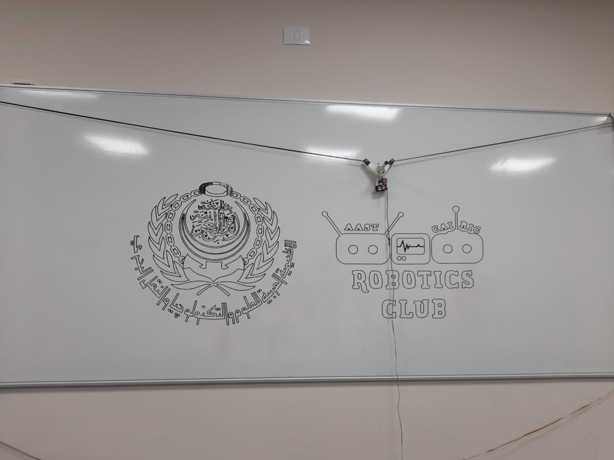
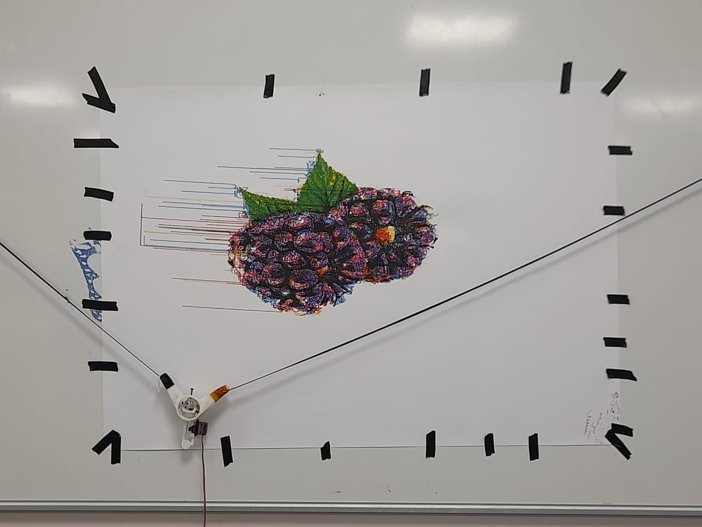

# Polargraph Drawing Machine

## Project Overview

The Polargraph Drawing Machine is a programmable device that translates digital images into physical drawings on surfaces of any size, using stepper motors to control the movement of a pen via tensioned wires. This project is ideal for educational demonstrations, art installations, and interactive teaching, offering flexibility in drawing any image on various dimensions.

For more details:
- **[Detailed Report](./202104091545%20Plotter%20Drawing%20Robot-converted.pdf)**
- **[Presentation](./polargraph-final-presentation.pptx)**

---

## Components

- **Arduino MEGA**
- **L293D Motor Drive Shield**
- **L293D Motor Drive IC**
- **2 x 17 Stepper Motors**
- **MG90S Servo Motor**
- **GT2 Pulley (16 Teeth)**
- **5M GT2 Rubber Belt**
- **12V Power Supply**
- **5V/3.5A Adapter**

---

## Project Phases

### Phase 1: Monochrome Image Drawing
The goal of the first phase is to draw a single-color image on a specific surface.

#### Steps:
1. **Hardware Design**: Using the [3D plotter design](https://www.thingiverse.com/thing:2371117/files) on Thingiverse, printed in plastic.
2. **Wiring Setup**: Connect stepper motors and the servo motor to the motor drive, attach the drive to the Arduino, and connect the motors using the rubber belt.  
   
3. **Image Processing**: Convert the selected image to grayscale, then to SVG format.
4. **Software**: Using [Processing](https://processing.org) software and Euphy's motor and servo controller code ([GitHub repository](https://github.com/euphy/polargraphcontroller/releases/tag/2017-11-01-20-30)), upload the SVG to generate vector path points and send these to the microcontroller.

#### Phase 1 Output:

---

### Phase 2: Full-Color Image Drawing
In this phase, the objective is to draw a full-color image using four primary colors. By applying the CMYK model (Cyan, Magenta, Yellow, and Black), four pens are used to layer each color and create the final multicolor image.

#### Steps:
1. **Image Splitting**: Use the Death2Sharpie algorithm to split the image into CMYK channels.
2. **Pen Setup**: Attach a corresponding color pen for each channel.
3. **SVG Generation**: Convert each color layer to SVG format.
4. **Processing and Drawing**: Insert each SVG layer into Processing to generate the path, then print each layer individually, manually switching pens for each color.

#### Phase 2 Output:

---

## Future Enhancements

We aim to automate the image preparation and color channeling process. Upcoming features include:

- **Automated Channel Splitting**: A script to automatically split images into CMYK channels, convert them to SVG, and feed them into Processing.
- **Automatic Pen Switching**: Hardware integration to switch pens without manual intervention.
- **Neural Style Transfer**: Incorporate neural style transfer to apply artistic styles to images before drawing.

This project is evolving to offer greater automation, efficiency, and artistic possibilities.
